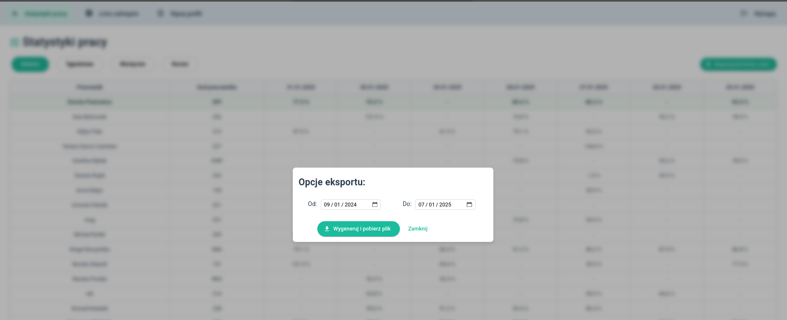

# Statistics Application for Rehabilitation / Wellness Center

This is a custom application for a rehabilitation/wellness center. It calculates employee efficiency based on performed activities and work schedules from xlsx files.
The basic version (one BE service and one FE service) is deployed on client's server, and serves many users.

---

## Application Objective

* Calculate employee efficiency statistics based on:

    * ACTIVITY.activityTime (table ZAJECIE)
    * Employee time windows from uploaded xlsx schedules

* Allow users to assign activities to themselves
* Allow to display the list of Activities and assigned users

### Calculation Rules:

* All activities with Procedure types F or B are group procedures. Time is divided between multiple employees involved in the group procedure.
* Activities U and S are calculated individually for each employee.
* Work schedules can include sick leaves, holidays, and substitutions. In those cases, statistics are calculated for the substituting employee (if one exists).

---

## Integration with Client System

* The statistics app had to integrate with the existing system on the client side.
* Limitation: I had to connect to a legacy Firebird 2.5.0 database (SQL dialect 1).

---

## Schedule Upload Flow

1. User uploads xlsx file.
   

(example file:)
[grafik_pracy_2025-01.xlsx](./_resources/grafik_pracy_2025-01.xlsx)

3. File is validated.
4. If a schedule for the same year and month exists:

    * All records are deleted from the WORK\_SCHEDULE table.
    * New records are inserted.
5. Assignments of activities (ZAJECIE) to employees and work schedules (table ACTIVITY\_EMPLOYEE) are created.

    * This step is a big bulk insert (about 50,000 rows per month).
    * Assignments are based on date, work mode, room, and employee time windows.

---

## Data Synchronization and Limitations

* An event-driven solution was not possible because the client system was closed, I considered Kafka integration but Firebird 2.5 does not support this.
* Hence: I used database polling:

    * A trigger in the ACTIVITY table sets the PROCESSED flag to 0 on the related work\_schedule record when an activity is added.
    * A scheduler checks every few minutes for unprocessed schedules. If found, assignment creation is triggered.
* Assignment creation is pushed to a JobQueue and executed in a separate thread, so the UI is not blocked during database inserts.

---

## Statistics Calculation

* Also triggered by a scheduler.

---

## Activity User Assignment Feature

* Users with the REASSIGN\_ALLOWED role can assign activities to themselves from the procedures list screen.
  

    * Validation: the assignment is allowed only if the employee has a corresponding work schedule entry for the date.
    * Previous assignments are saved to a history table, and the user can always revert their change from the UI.
    * User-created assignments are **not overwritten** when a new schedule is uploaded.

---

## Output and UI

* Statistics are available for download in xlsx format for any selected period.
  
* Statistics are also displayed in the UI list.
  
* After either failed or passed schedule validation, users can download a txt file with schedule processing logs.
  
---

## User Roles

User roles are based on the EMPLOYEE.LOYALTY\_PIN column:

* LOYALTY\_PIN = 0: Default – only sees statistics screen.
* LOYALTY\_PIN = 1: REASSIGN\_ALLOWED – sees statistics and procedures list, can assign activities to themselves.
* LOYALTY\_PIN = 2: ADMIN – can upload work schedules (and all above).

---

## Backend and Additional Services

### Main Backend

* stats-app-main-be-service

### For practice and additional features:

* gRPC communication
* Kafka broker
* CI/CD: Jenkins, GitHub, docker-compose for all services
* MongoDB

### Additional services:

* schedule-report-kafka-producer

    * Communicates with the main service via gRPC
    * Receives work schedules, pushes them to Kafka broker

* notification-service

    * Consumes messages from Kafka
    * Saves consumed schedules to MongoDB
    * Calls SMTP service to send emails with schedules as CSV attachments

---

## Deployment

* Jenkins pipeline checks out the repo and builds all projects from Dockerfiles.
* Oracle Free Tier set up for deployment (currently sometimes waiting for available machine). Also with Kubernetes.
* The version used by the client runs on-premises as Docker containers (client only uses frontend and main backend service).
